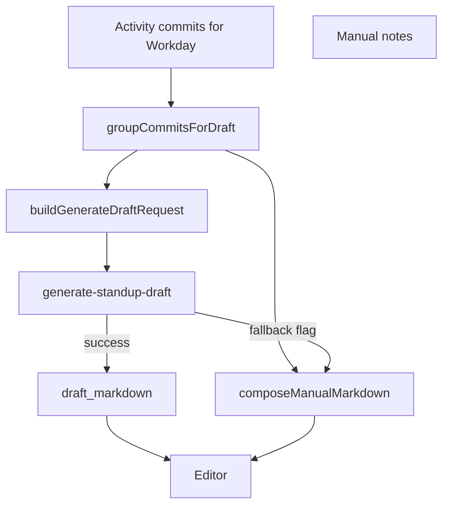

# Multi-Repo Standup Draft — design spec

**Date:** 2026-05-27  
**Status:** Approved for implementation (user review 2026-05-27)

## Goal

Fix **AI Draft** and **manual fallback** so multi-repo **Workdays** produce a PM-readable standup: per-repo **Summary** prose, repo-grouped **What I did**, and clear distinction when AI did not run.

Builds on team-facing prompt work (**Standup audience**, outcome-first bullets) and addresses observed failure mode: Generate appears to succeed but editor shows `composeManualMarkdown` output (placeholder Summary, `repo: commit (PR #…)` lines, `…and N more commits`).

## Problem (observed)

Example output for one **Workday** across `tku-sparring` and `standup-log`:

- **Summary** = `Write a short standup message for your team chat…` (client placeholder only — not from AI prompt).
- **What I did** = one bullet per commit (capped at 15 + overflow line), prefixed by repo slug.
- **Metrics** may include `Tickets in progress:` from manual template.

User confirmed: Generate showed **no error**, but content matches manual fallback shape. Likely causes: edge function error with silent fallback, and/or AI response not applied; root fix includes UX visibility **and** structural grouping.

## Decisions (locked)

| Topic                     | Decision                                                                                                                 |
| ------------------------- | ------------------------------------------------------------------------------------------------------------------------ |
| **What I did** (2+ repos) | `### {repo-short-name}` subheadings, team-facing bullets grouped by PR/theme underneath                                  |
| **What I did** (1 repo)   | **No** repo subheading — flat outcome bullets only                                                                       |
| **Summary**               | **1–3 outcome sentences per repo** that had activity that **Workday** (team-facing, no commit/PR lists)                  |
| **Summary** (1 repo)      | 1–3 sentences, no repo label prefix required                                                                             |
| **Traceability**          | Outcome-first bullets; optional one parenthetical tail (product area **or** PR N) per bullet — same as team-facing rules |
| **Bullet cap**            | No fixed max; group commits on same PR/theme — never one bullet per commit when shared PR/theme                          |
| **Fallback UX**           | Visible banner when editor content is manual fallback, not AI draft                                                      |
| **Tickets in Metrics**    | Omit from AI template and align manual template (no invented counts)                                                     |

## Target markdown shapes

### Two repositories

```markdown
# Daily Standup — Wed, May 20, 2026

## Summary

**tku-sparring:** Released 2.1.5, fixing bracket matches that did not advance after a winner was declared.

**standup-log:** Shipped phase 10–11 hardening: voice notes, empty-workday flow, multi-format copy, analytics, and repository/settings refactors.

## ✅ What I did

### tku-sparring

- Released 2.1.5 with bracket advancement fix (PR 175)

### standup-log

- Shipped phase 11 features including on-device voice notes, guided empty workday, and editable commit work types (PR 6)
- Merged staging into main for the phase 10–11 release batch (PR 6)

## 🔨 Focusing on

-

## 🚧 Blockers

-

## 📊 Metrics / Notes

- PRs open: 0
- PRs merged: 2

---

_Time boxed: 5 min_
```

### Single repository

```markdown
## Summary

Shipped phase 11 hardening for StandupLog, including voice notes, empty-workday guidance, and multi-format copy.

## ✅ What I did

- Shipped on-device voice notes and guided empty-workday flow (PR 6)
- Added PRD funnel analytics and copy-format settings (PR 6)
```

(No `###` subheading under **What I did** when only one repo has signals.)

## Architecture

### 1. Shared grouping (`groupCommitsForDraft`)

New pure function (location: `src/features/standup/lib/group-commits-for-draft.ts`, re-used or mirrored in edge prompt module):

```ts
type RepoDraftGroup = {
  repositoryShortName: string; // e.g. "standup-log"
  repositoryFullName: string; // e.g. "org/standup-log"
  commits: GenerateDraftCommitInput[];
};

type PrThemeGroup = {
  prNumber: number | null;
  prTitle: string | null;
  commits: GenerateDraftCommitInput[];
};

// Returns repos sorted by name; within each repo, cluster by pr_number (null PR = own cluster per commit or single "direct" cluster).
```

Used by:

- `buildDraftUserPrompt` (edge) — structured context instead of flat commit list
- `composeManualMarkdown` — same repo/PR grouping for fallback bullets

### 2. AI prompt (`ai-draft-prompt.ts`)

- **User prompt:** Per-repo sections, e.g. `Repository: standup-log` with PR-grouped commit lines (keep sha for classifications).
- **Template + SYSTEM_PROMPT:** Require Summary with **bold repo label + 1–3 sentences** per repo with activity when 2+ repos; single-repo Summary without label.
- **What I did:** Instruct `### {repo}` only when multiple repositories in input; one repo → flat bullets.
- **Few-shot:** Include multi-repo example matching target shape above.
- Remove duplicate blank lines in prompt file (formatting cleanup).

### 3. Manual fallback (`compose-standup-markdown.ts`)

- Replace per-commit bullet list with grouped repo structure (same rules as AI for **What I did**).
- **Summary:** Do not use `STANDUP_SUMMARY_PLACEHOLDER` as final body. Instead:
  - **2+ repos:** one line per repo: `**{repo}:** *(Write 1–3 outcome sentences for your team.)*`
  - **1 repo:** `*(Write 1–3 outcome sentences for your team.)*`
- Drop `Tickets in progress:` from manual template (align with AI).
- Keep `MAX_ACTIVITY_BULLETS` only if needed for edge cases; prefer grouping over truncation — if truncation remains, apply at **theme/PR** level not raw commit count, or raise cap substantially with grouping (no `…and N more commits` when themes are merged).

### 4. Draft source UX

Extend standup session state:

```ts
draftSource: 'ai' | 'fallback' | 'saved' | null;
```

Set in `runAiDraft`:

- `ai` — successful edge response applied
- `fallback` — `composeManualMarkdown` used after failure/offline
- `saved` — loaded from DB without regeneration

UI (`StandupDraftPanel` or sticky actions): when `draftSource === 'fallback'`, show banner:

> **Activity fallback** — AI draft unavailable. Grouped commits below; write per-repo summaries or tap Regenerate.

Do not show generic `userFacingMessage('ai')` as the only signal when editor is already filled.

### 5. Edge / deploy

Verify `generate-standup-draft` is deployed with `ANTHROPIC_API_KEY`. Log or return distinct error codes (already partially present) for debugging silent fallback.

## Data flow



## Error handling

| Case                             | Behavior                                                             |
| -------------------------------- | -------------------------------------------------------------------- |
| AI success                       | `draftSource = ai`, full per-repo Summary + grouped What I did       |
| AI failure / timeout / malformed | `draftSource = fallback`, banner + manual grouped body               |
| Offline                          | Same as fallback + network message                                   |
| Rate limit                       | No fallback overwrite; keep prior draft if any; show rate limit copy |
| Zero signals                     | Existing empty-workday guide (unchanged)                             |

## Testing

| Area                    | Tests                                                                     |
| ----------------------- | ------------------------------------------------------------------------- |
| `groupCommitsForDraft`  | 2 repos; 1 repo; same PR many commits → one theme; commits without PR     |
| `composeManualMarkdown` | Multi-repo `###` headings; single-repo no heading; Summary lines per repo |
| `buildDraftUserPrompt`  | Contains `Repository:` blocks; multi-repo instructions                    |
| `SYSTEM_PROMPT`         | Per-repo Summary rule; conditional `###` for What I did                   |
| Provider                | `draftSource` set correctly on mock invoke success/failure                |

## Out of scope

- User setting for “technical vs team” audience
- Product glossary / repo display names in settings
- Increasing Claude `max_tokens` (note risk for very large days; revisit if truncated AI output)
- Changing **Copy summary** to concatenate per-repo blocks (already works if Summary section has prose)

## Success criteria

- Multi-repo **Workday** with successful Generate: Summary has 1–3 team-facing sentences **per repo**; What I did uses `###` repo sections.
- Single-repo **Workday**: no `###` under What I did; Summary is 1–3 sentences without repo header.
- Failed Generate: banner visible; no commit-by-commit dump; no `Write a short standup message…` as only Summary content.
- `Copy summary` disabled until all required Summary prose is present (per-repo lines count as not ready if still placeholder instruction).

## Related docs

- [CONTEXT.md](../../CONTEXT.md) — **Standup audience**, **Team-facing language**
- [PRD.md](../../PRD.md) — AI Generation
- Team-facing prompt plan (implemented in `ai-draft-prompt.ts`)

## Manual QA checklist

- [ ] Two repos, many commits on one PR → one bullet under that repo, not 10+
- [ ] Generate success → per-repo Summary sentences; no placeholder
- [ ] Generate failure (revoke API key / airplane mode) → banner + grouped fallback, no silent “success” feel
- [ ] Single repo → no `###` in What I did
- [ ] Regenerate after edit preserves workday scope
- [ ] Metrics: PR counts only; no `Tickets in progress: 0`
