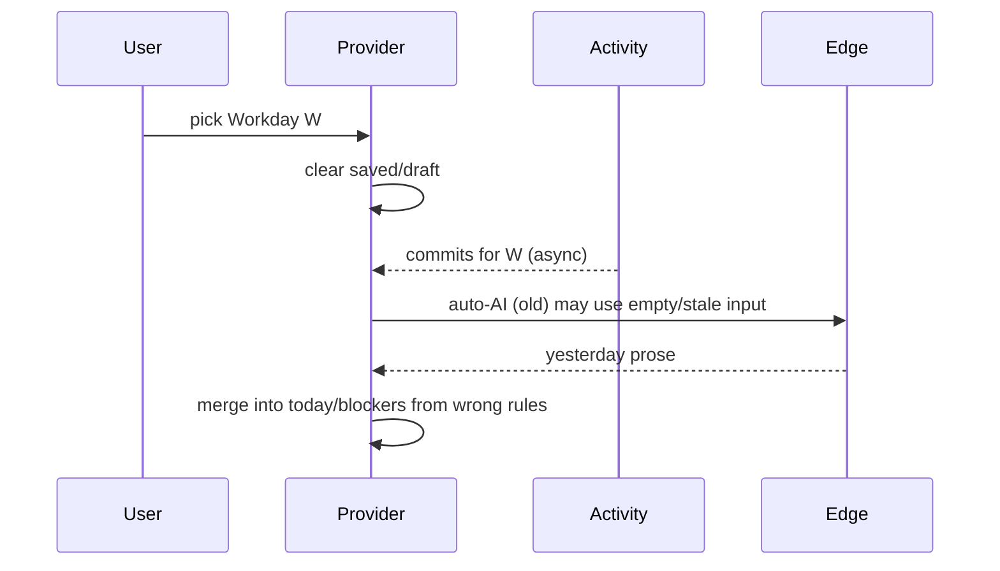

# Standup draft redesign — Workday-scoped markdown + editor

> **For agentic workers:** REQUIRED SUB-SKILL: Use superpowers:subagent-driven-development or superpowers:executing-plans for task-by-task execution.

**Goal:** Selecting Workday `W` always loads/generates the standup _for_ `W` into one markdown draft; AI fills the full template from that day’s activity and notes; user edits in Edit/Preview modes and taps Generate manually.

**Architecture:** `standup_updates.draft_markdown` becomes source of truth. Edge Function returns full markdown + commit classifications. Client removes auto-AI, fixes workday lifecycle races, and adds quota UI. Copy formatters parse template sections from markdown (fallback: copy raw markdown).

**Tech stack:** Expo 55 / RN 0.83, Supabase Edge (Anthropic), [react-native-remark](https://www.npmjs.com/package/react-native-remark) (preview), Reusables UI, Bun.

**Plan file (post-approval):** Save full task breakdown to [`docs/superpowers/plans/2026-05-20-standup-markdown-draft.md`](docs/superpowers/plans/2026-05-20-standup-markdown-draft.md) per writing-plans skill.

---

## Git workflow — one commit per todo

**Branch:** Stay on the current branch (e.g. `staging`). **Do not** create a feature branch or worktree.

**Rule:** Complete one todo → run tests relevant to that todo → **one git commit** → move to next todo. Never batch multiple todos into a single commit.

**When the user asks to commit:** follow repo commit protocol; message via HEREDOC; include `bun.lock` only when dependencies changed that step.

| Todo ID | Commit message (subject) |
| ------- | ------------------------ |
| `rca-document` | `test(standup): add workday scoping regression tests` |
| `db-migration` | `feat(db): standup draft_markdown and ai_generation_events` |
| `edge-ai` | `feat(edge): full markdown draft, rate limit, and 429 responses` |
| `provider-fix` | `fix(standup): workday lifecycle and remove auto-AI` |
| `markdown-lib` | `refactor(standup): markdown compose, parse, and API` |
| `draft-ui` | `feat(standup): markdown edit/preview draft panel` |
| `context-glossary` | `docs: single markdown Standup Update per Workday` |
| `verify-deploy` | `chore: verify standup markdown draft rollout` |

`verify-deploy` may be **commit skipped** if the working tree is clean after the prior seven commits (verification is commands-only). If plan doc or checklist files were updated during verification, commit those under the `verify-deploy` message.

---

## Phase 1 — Root cause (systematic debugging) — todo `rca-document`

### Confirmed failure modes

| Issue                     | Where                                                                                       | Why it breaks Workday correctness                                                                                                                     |
| ------------------------- | ------------------------------------------------------------------------------------------- | ----------------------------------------------------------------------------------------------------------------------------------------------------- |
| **Focus reset**           | [`provider.tsx`](src/features/standup/context/standup/provider.tsx) `useFocusEffect` L56–64 | Resets `workday` to `defaultTargetWorkday()` on every screen focus, wiping user’s picker selection and clearing drafts                                |
| **Split draft semantics** | `mergeAiDraft` + `composeManualStandup`                                                     | AI only fills `yesterday`; `today` uses _current-session_ placeholder + carry-forward notes for `beforeWorkday=W` — wrong when browsing past Workdays |
| **Misleading labels**     | [`standup-editor.tsx`](src/features/standup/components/standup-editor.tsx)                  | Section titled “Yesterday” shows commits **on** selected Workday, not calendar “yesterday”                                                            |
| **Auto-AI races**         | `provider.tsx` L203–232                                                                     | Fires once per workday when no saved standup; can run before activity/notes finish loading; silent fallback masks wrong-day content                   |
| **Stale activity cache**  | [`use-activity-sync.ts`](src/features/activity/hooks/use-activity-sync.ts)                  | Per-workday cache is correct, but auto-AI + focus reset can present composed draft before sync completes                                              |



### Success criteria (bug fix)

- Pick Workday `2026-05-19` → activity + notes + saved draft all keyed to `2026-05-19`.
- Navigate away and back → **same** Workday still selected (unless user explicitly resets).
- Generate uses **only** commits/notes for `W`; output is full template for `W`.
- No network call on load when draft empty.

**Steps → commit:**

- [ ] Add failing tests (e.g. provider workday not reset on refocus; generate request uses picker `workday`).
- [ ] Run `bun run test` — expect new tests to fail against current code (documents bug).
- [ ] **Commit** `test(standup): add workday scoping regression tests` (todo `rca-document`).

---

## Phase 2 — Domain + data model — todo `db-migration`

### User-chosen template (canonical)

```markdown
# Daily Standup — [Date]

## ✅ What I did

-

## 🔨 Focusing on

-

## 🚧 Blockers

-

## 📊 Metrics / Notes

- PRs open:
- PRs merged:
- Tickets in progress:

---

_Time boxed: 5 min_
```

- `[Date]` = selected Workday formatted for display (e.g. `Mon, May 19, 2026`).
- Update [`CONTEXT.md`](CONTEXT.md): **Standup Update** stores one markdown body per **Workday**; retire ambiguous “Yesterday section” language in glossary (keep “Workday” definition).

### DB migration

New migration e.g. `supabase/migrations/20260522120000_standup_draft_markdown.sql`:

- Add `draft_markdown text not null default ''` to `standup_updates`.
- Backfill from legacy columns via deterministic converter (`yesterday` → What I did, `today` → Focusing on, `blockers` → Blockers).
- Drop `yesterday_text`, `today_text`, `blockers_text` after backfill (or keep nullable deprecated columns one release — prefer clean drop for MVP).
- Add `ai_generation_events` table: `(id, user_id, workday, created_at)` for rate limiting + audit.

### Rate limit (free tier)

- **5 generations per rolling minute** per user (Pro: unlimited or higher cap — stub `is_pro` check like repo limits).
- Enforced in Edge Function **before** Anthropic call (server source of truth).
- Return `429` with `{ error: 'rate_limited', retry_after_seconds, remaining: 0 }`.
- Client hook `useAiGenerationQuota` polls/decodes from last invoke + local countdown (implemented in `draft-ui`; table only here).

**Steps → commit:**

- [ ] Add migrations `20260522120000_standup_draft_markdown.sql` and `20260522120001_ai_generation_events.sql`.
- [ ] Backfill + drop legacy columns; unit test converter if in same migration PR slice.
- [ ] Run `bun run test` (converter tests if added).
- [ ] **Commit** `feat(db): standup draft_markdown and ai_generation_events` (todo `db-migration`).

---

## Phase 3 — AI contract (Edge + client) — todo `edge-ai`

### [`generate-standup-draft/index.ts`](supabase/functions/generate-standup-draft/index.ts)

**Request:** unchanged shape (`workday`, `commits`, `notes`) — `workday` is explicit.

**Response:**

```json
{
  "draft_markdown": "# Daily Standup — ...",
  "classifications": [{ "sha": "...", "work_type": "feature" }]
}
```

**Prompt changes:**

- System: generate **full markdown** matching template; populate from commits + notes on **that Workday only**; blockers only from `is_blocker` notes on that day; no invented metrics; no future plans beyond “Focusing on” from carry-forward/focus notes on `W`.
- User prompt: include `Workday: YYYY-MM-DD` and instruction “this standup is FOR this calendar day.”

**Rate limit:** count rows in `ai_generation_events` where `created_at > now() - interval '1 minute'`; insert event on success; optional insert on 429 attempt (product choice: count attempts vs successes — recommend **count successful** only).

### Client pipeline

| File                                                                                          | Change                                                                                                              |
| --------------------------------------------------------------------------------------------- | ------------------------------------------------------------------------------------------------------------------- |
| [`ai-draft-types.ts`](src/features/standup/lib/ai-draft-types.ts)                             | `draft_markdown` response type                                                                                      |
| [`generate-ai-draft.ts`](src/features/standup/lib/generate-ai-draft.ts)                       | Parse new shape; surface Edge `error` string in UI                                                                  |
| [`build-generate-draft-request.ts`](src/features/standup/lib/build-generate-draft-request.ts) | Add PR counts from commits if available for Metrics section hints                                                   |
| **Remove** [`merge-ai-draft.ts`](src/features/standup/lib/merge-ai-draft.ts)                  | Replaced by direct markdown assignment                                                                              |
| [`compose-standup.ts`](src/features/standup/lib/compose-standup.ts)                           | → `compose-standup-markdown.ts`: `buildEmptyTemplate(workday)`, `composeManualMarkdown(input)` for offline fallback |
| [`provider.tsx`](src/features/standup/context/standup/provider.tsx)                           | Remove auto-AI `useEffect`; fix focus behavior; `draftMarkdown` state; generation only via `regenerateDraft()`      |

### Provider workday lifecycle fix

```tsx
// useFocusEffect: only reset workday if user hasn't picked this session
// OR remove workday reset entirely — only reset draft state flags
```

Recommended: **stop resetting `workday` on focus**; only reset `savedSections`/`draft` when `workday` changes via picker. On first mount, initialize once to `defaultTargetWorkday()`.

Add **generation guard:** `if (loadingActivity || loadingNotes || loadingStandup) return` inside `runAiDraft` (provider slice — todo `provider-fix`).

**Steps → commit (Edge + client invoke types only; no provider/UI yet):**

- [ ] Update [`generate-standup-draft/index.ts`](supabase/functions/generate-standup-draft/index.ts): template prompt, `draft_markdown` response, rate limit, `429`.
- [ ] Update [`ai-draft-types.ts`](src/features/standup/lib/ai-draft-types.ts), [`generate-ai-draft.ts`](src/features/standup/lib/generate-ai-draft.ts), [`generate-ai-draft.test.ts`](src/features/standup/lib/generate-ai-draft.test.ts).
- [ ] Run `bun run test` — AI client tests pass.
- [ ] **Commit** `feat(edge): full markdown draft, rate limit, and 429 responses` (todo `edge-ai`).

---

## Phase 3b — Provider — todo `provider-fix`

**Steps → commit:**

- [ ] [`provider.tsx`](src/features/standup/context/standup/provider.tsx): remove auto-AI `useEffect`; fix `useFocusEffect` (no workday reset on refocus); `draftMarkdown` state; generation guard in `runAiDraft`.
- [ ] [`context.ts`](src/features/standup/context/standup/context.ts): replace `StandupSections` draft fields with `draftMarkdown` / `savedMarkdown`.
- [ ] Run `bun run test` — regression tests from `rca-document` should pass.
- [ ] **Commit** `fix(standup): workday lifecycle and remove auto-AI` (todo `provider-fix`).

---

## Phase 3c — Markdown lib — todo `markdown-lib`

**Steps → commit:**

- [ ] Add [`compose-standup-markdown.ts`](src/features/standup/lib/compose-standup-markdown.ts) + tests; add [`parse-standup-markdown.ts`](src/features/standup/lib/parse-standup-markdown.ts) + tests.
- [ ] Update [`standup-api.ts`](src/features/standup/lib/standup-api.ts), [`record-standup-copy.ts`](src/features/standup/lib/record-standup-copy.ts), [`offline-cache.ts`](src/features/standup/lib/offline-cache.ts), [`format-standup.ts`](src/features/standup/lib/format-standup.ts); remove [`merge-ai-draft.ts`](src/features/standup/lib/merge-ai-draft.ts) and obsolete section types/usages.
- [ ] Wire provider to `composeManualMarkdown` fallback (no UI yet).
- [ ] Run `bun run test` && `bun run lint`.
- [ ] **Commit** `refactor(standup): markdown compose, parse, and API` (todo `markdown-lib`).

---

## Phase 4 — Dedicated draft UI — todo `draft-ui`

Replace [`standup-draft-section.tsx`](src/features/standup/components/standup-draft-section.tsx) + [`standup-editor.tsx`](src/features/standup/components/standup-editor.tsx) with:

### `StandupDraftPanel` (new)

- Header: “Standup for {formatted Workday}”
- **Segmented control:** Edit | Preview (GitHub-style)
- **Edit mode:** `TextInput` multiline, `font-mono`, min height ~240, no WebView (MVP); syntax highlight deferred unless trivial
- **Preview mode:** [`react-native-remark`](https://www.npmjs.com/package/react-native-remark) with `themes.github`, wired to app dark/light via `useAppColorScheme`
- Actions row: **Save**, **Copy** (format picker), **Generate** (primary)
- **Quota strip** (free): “4/5 generations left · resets in 42s” / rate-limited state

### Copy formatters

New [`parse-standup-markdown.ts`](src/features/standup/lib/parse-standup-markdown.ts): extract sections by `## ✅ What I did` etc.

Update [`format-standup.ts`](src/features/standup/lib/format-standup.ts) to accept `draftMarkdown: string` + format — map parsed sections into existing Slack/Jira/Notion formatters (minimal change) or add `formatRawMarkdown` for plain copy.

### Dependencies

```bash
bun add react-native-remark
```

**Tiptap:** Not recommended for MVP — official Tiptap is web/DOM; RN path is `@10play/tentap-editor` + WebView + dev client (heavier than remark + TextInput). Aligns with your GitHub-like preference.

**Steps → commit:**

- [ ] `bun add react-native-remark` (commit lockfile in this step).
- [ ] Add `standup-draft-panel.tsx`, `standup-markdown-editor.tsx`, `ai-generation-quota.tsx`; replace draft section wiring in [`standup/index.tsx`](src/app/(app)/standup/index.tsx) exports.
- [ ] Remove or gut legacy [`standup-editor.tsx`](src/features/standup/components/standup-editor.tsx) / [`standup-draft-section.tsx`](src/features/standup/components/standup-draft-section.tsx).
- [ ] Run `bun run test` && `bun run lint`; smoke Edit/Preview on device.
- [ ] **Commit** `feat(standup): markdown edit/preview draft panel` (todo `draft-ui`).

---

## Phase 4b — Glossary — todo `context-glossary`

**Steps → commit:**

- [ ] Update [`CONTEXT.md`](CONTEXT.md): one markdown **Standup Update** per **Workday**; remove Yesterday/Today/Blockers glossary confusion.
- [ ] **Commit** `docs: single markdown Standup Update per Workday` (todo `context-glossary`).

---

## Phase 5 — Tests and verification — todo `verify-deploy`

| Area                               | Tests                                                                                    |
| ---------------------------------- | ---------------------------------------------------------------------------------------- |
| `compose-standup-markdown.test.ts` | Template includes workday date; manual bullets land under What I did                     |
| `parse-standup-markdown.test.ts`   | Round-trip section extraction                                                            |
| `generate-ai-draft.test.ts`        | New response shape                                                                       |
| Edge (manual)                      | POST with auth; 6th call in 1 min → 429                                                  |
| E2E manual                         | Pick May 19 → Generate → markdown references May 19 activity only; preview renders lists |

**Steps (no new branch):**

- [ ] `bun run test` && `bun run lint` (full suite).
- [ ] `supabase db push` (remote migrations).
- [ ] `bunx supabase functions deploy generate-standup-draft`.
- [ ] Manual E2E: two Workdays, Generate, rate limit 6th call, refocus keeps picker.
- [ ] Copy plan to [`docs/superpowers/plans/2026-05-20-standup-markdown-draft.md`](docs/superpowers/plans/2026-05-20-standup-markdown-draft.md) if not already synced.
- [ ] **Commit** `chore: verify standup markdown draft rollout` only if docs/checklist files changed; otherwise skip commit for this todo.

---

## File map (primary touch)

```
supabase/migrations/20260522120000_standup_draft_markdown.sql
supabase/migrations/20260522120001_ai_generation_events.sql
supabase/functions/generate-standup-draft/index.ts
src/features/standup/lib/compose-standup-markdown.ts
src/features/standup/lib/parse-standup-markdown.ts
src/features/standup/lib/standup-api.ts
src/features/standup/lib/record-standup-copy.ts
src/features/standup/lib/offline-cache.ts
src/features/standup/context/standup/provider.tsx
src/features/standup/context/standup/context.ts
src/features/standup/components/standup-draft-panel.tsx
src/features/standup/components/standup-markdown-editor.tsx
src/features/standup/components/ai-generation-quota.tsx
CONTEXT.md
```

---

## Risks and mitigations

| Risk                                                            | Mitigation                                                                                      |
| --------------------------------------------------------------- | ----------------------------------------------------------------------------------------------- |
| `react-native-remark` uses `react-syntax-highlighter` (web-ish) | Verify on iOS/Android in dev client early; fallback preview = ScrollView + plain Text if broken |
| Copy formatters break on freeform edits                         | Parse loose; plain copy always dumps full markdown                                              |
| Migration loses custom edits                                    | Backfill converter covered by unit test fixtures                                                |

---

## Out of scope (this plan)

- TenTap / Tiptap rich-text WYSIWYG
- Phase 8 billing (use existing `is_pro` flag for quota only)
- Syntax-highlighted edit mode (follow-up if TextInput feels too plain)
